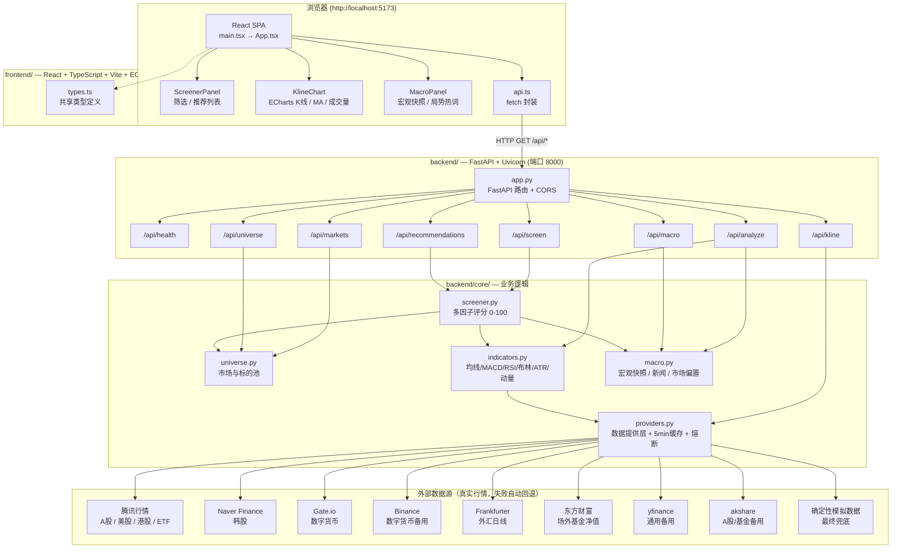
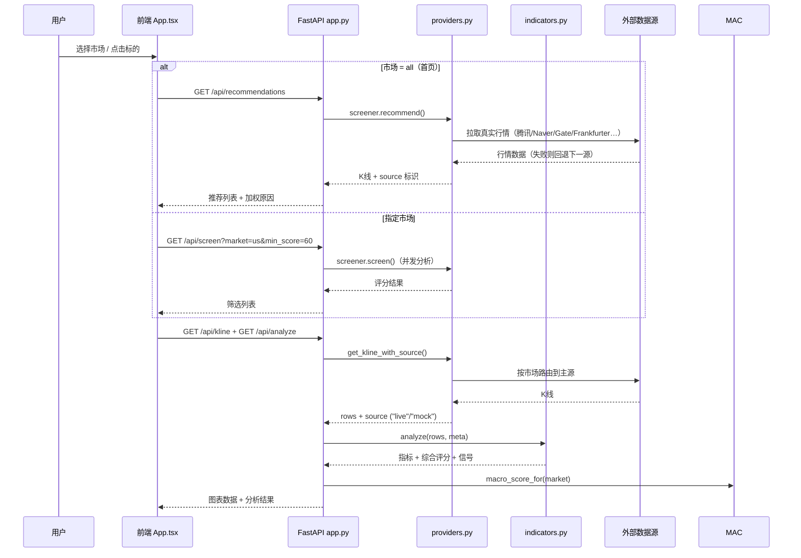

# Global Finance Research Terminal — 系统架构图

> 基于当前代码（`backend/` + `frontend/`）生成的架构说明，与实现同步。

## 总体架构



## 请求数据流



## 关键设计

| 关注点 | 实现 |
|---|---|
| **多市场路由** | `providers.py` 按市场选择主源：A股/美股/港股→腾讯，韩股→Naver，数字货币→Gate.io，外汇→Frankfurter，场外基金→东方财富 |
| **高可用降级** | 主源失败 → 备用源（yfinance/akshare/Binance）→ 确定性模拟数据，`source` 字段标识 `live`/`mock` |
| **性能** | 5 分钟内存缓存（线程安全锁）+ 失败源 120 秒熔断（`_dead_providers`） |
| **评分模型** | `indicators.py` 计算技术指标 → `screener.py` 综合趋势/动能/波动/风险/宏观因子 → 0-100 分 |
| **推荐解释** | 每个标的附加权原因（技术指标/宏观/地缘/资金流/政策/行业/风险） |
| **CORS** | FastAPI 全放开，便于前端 5173 ↔ 后端 8000 跨端口调试 |

## 启动拓扑

```text
┌─────────────┐   HTTP/JSON   ┌──────────────┐   HTTPS    ┌──────────────────┐
│ Vite dev    │ ────────────▶ │ FastAPI      │ ─────────▶ │ 腾讯/Naver/Gate/  │
│ :5173       │               │ :8000        │            │ Frankfurter/东财  │
└─────────────┘               └──────────────┘            └──────────────────┘
```

- 后端：`python -m uvicorn app:app --reload --port 8000`
- 前端：`pnpm dev` → `http://localhost:5173`
