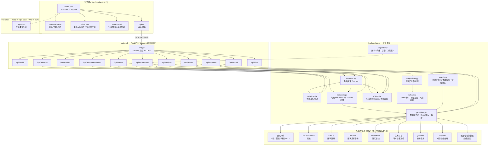
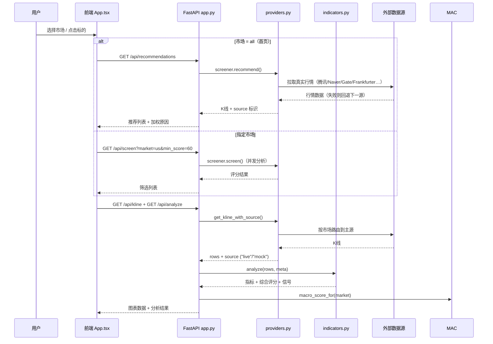

# Global Finance Research Terminal — 系统架构图

> 基于当前代码（`backend/` + `frontend/`）生成的架构说明，与实现同步。

## 总体架构



## 请求数据流



## 关键设计

| 关注点 | 实现 |
|---|---|
| **多市场路由** | `providers.py` 按市场选择主源：A股/美股/港股→腾讯，韩股→Naver，数字货币→Gate.io，外汇→Frankfurter，场外基金→东方财富 |
| **高可用降级** | 主源失败 → 备用源（yfinance/akshare/Binance）→ 确定性模拟数据，`source` 字段标识 `live`/`mock` |
| **性能** | 5 分钟内存缓存（线程安全锁）+ 失败源 120 秒熔断（`_dead_providers`） |
| **评分模型** | `indicators.py` 计算技术指标 → `screener.py` 综合趋势/动能/波动/风险/宏观因子 → 0-100 分 |
| **推荐解释** | 每个标的附加权原因（技术指标/宏观/地缘/资金流/政策/行业/风险） |
| **CORS** | FastAPI 全放开，便于前端 5173 ↔ 后端 8000 跨端口调试 |
| **天级缓存** | `search.py` 的 `daily_cache_get/set` 按自然日判定，同一键同一天只评估一次 |

## 模块一（工程）/ 模块二（算法）拆分

系统按「工程层 / 算法层」双向解耦，算法可插拔、可独立测试：

### 模块一（工程层）— `backend/core/` 根目录

| 模块 | 职责 |
|---|---|
| `providers.py` | 数据提供：真实源路由 + 熔断 + 确定性模拟兜底 |
| `search.py` | 任意代码跨市场识别（`detect_market`/`normalize_symbol`）、元数据解析（`resolve_meta`）、天级缓存 |
| `indicators.py` | 技术指标：均线/MACD/RSI/布林/ATR/年化波动 |
| `screener.py` | 多因子评分 0-100 与推荐列表 |
| `macro.py` | 宏观快照 / 新闻 / 市场偏置 |
| `valuation/` | 统一 RMB 计价（`currency.py`：复合折算公式）与购汇额度约束（`constraints.py`：5 万美元/年）；风险调整后收益指标（`metrics.py`：最大回撤/年化/卡玛/夏普） |
| `comparison.py` | 跨资产比较编排：RMB 口径风险调整后收益排序（卡玛降序，None 置底） |

### 模块二（算法层）— `backend/core/algorithms/`

算法层只消费 `AnalysisContext` 数据契约（`algorithms/context.py`：symbol/market/currency/klines/macro_bias/news_sentiment/fx_rate/horizon），**不 import providers、不发起网络请求**，便于离线单测与替换：

| 子模块 | 内容 |
|---|---|
| `factors/` | 因子 ABC + 五个可插拔因子（trend/momentum/volatility/risk/macro），`FACTOR_REGISTRY` 注册表 |
| `sentiment/` | 情绪分析 ABC + `NewsRuleAnalyzer`（乘数 = 1 + 0.2×polarity），`SENTIMENT_REGISTRY` 注册表 |
| `engines/` | 推荐引擎 ABC + `WeightedEngine`（截面 z-score → 加权 → sigmoid 0-100 → 情绪乘数），`ENGINE_REGISTRY` 注册表 |
| `config.py` | `DEFAULT_CONFIG` + `build_engine` 工厂：按配置装配因子/情绪/引擎 |

**可插拔机制**：注册表（`*_REGISTRY`）按名称映射实现类，新增因子/分析器/引擎只需实现 ABC 并注册，工程层与调用方零改动；`build_engine(config)` 通过配置串起整条算法链。

## 启动拓扑

```text
┌─────────────┐   HTTP/JSON   ┌──────────────┐   HTTPS    ┌──────────────────┐
│ Vite dev    │ ────────────▶ │ FastAPI      │ ─────────▶ │ 腾讯/Naver/Gate/  │
│ :5173       │               │ :8000        │            │ Frankfurter/东财  │
└─────────────┘               └──────────────┘            └──────────────────┘
```

- 后端：`python -m uvicorn app:app --reload --port 8000`
- 前端：`pnpm dev` → `http://localhost:5173`
